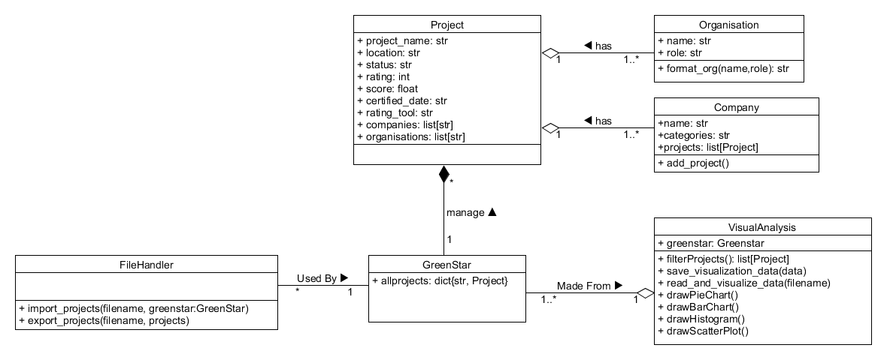

# Create the README.md file and add the initial section
echo "# GreenStar Project Directory" > README.md
echo. >> README.md
echo "This project was developed for the CSIT121 Object-Oriented Design and Programming course at the University of Wollongong. It focuses on managing and analyzing Green Star project data, providing comprehensive visual analysis based on user requirements." >> README.md
echo. >> README.md
echo "## Student Information" >> README.md
echo "- **Student Name:** Tonmoy Sarker" >> README.md
echo "- **Student Number:** 8239083" >> README.md
echo "- **Tutorial:** CSIT121" >> README.md
echo. >> README.md
echo "## Project Overview" >> README.md
echo "The GreenStar Project Directory is designed to manage and visualize a wide array of project data, including intricate details about projects, associated companies, and organizations involved. The program enables users to generate visual data based on user requirements, which can be saved in a JSON file and later exported to regenerate the visual analysis." >> README.md
echo. >> README.md
echo "### Key Features" >> README.md
echo "- **Object-Oriented Design:** Utilizes principles of object-oriented analysis and design to encapsulate project data, participating companies, and organizations." >> README.md
echo "- **Modular Architecture:** The project is structured with six key classes: Project, Organisation, Company, GreenStar, FileHandler, and VisualAnalysis, each encapsulating specific functionalities." >> README.md
echo "- **Data Management:** Allows importing and exporting of project details from JSON files." >> README.md
echo "- **Visualization:** Generates visual reports such as pie charts, bar charts, histograms, and scatter plots based on various project attributes." >> README.md
echo. >> README.md
echo "## Class Designs and Patterns" >> README.md
echo "The GreenStar Project Directory is built using the following classes:" >> README.md
echo. >> README.md
echo "1. **Project:** Manages project-related data including associations with companies and organizations." >> README.md
echo "2. **Organisation:** Represents organizations participating in Green Star projects." >> README.md
echo "3. **Company:** Represents companies involved in Green Star projects." >> README.md
echo "4. **GreenStar:** Serves as a container for all Green Star projects." >> README.md
echo "5. **FileHandler:** Ensures smooth import and export of project details from JSON files." >> README.md
echo "6. **VisualAnalysis:** Allows users to create visual reports and export the data for future use." >> README.md
echo. >> README.md
echo "## How to Run" >> README.md
echo "1. Ensure you have Python installed." >> README.md
echo "2. Clone the repository:" >> README.md
echo "   \`\`\`bash" >> README.md
echo "   git clone https://github.com/ts42a/GreenStar-Project.git" >> README.md
echo "   cd GreenStar-Project" >> README.md
echo "   \`\`\`" >> README.md
echo "3. Run the main script:" >> README.md
echo "   \`\`\`bash" >> README.md
echo "   python Tonmoy_A3.py" >> README.md
echo "   \`\`\`" >> README.md
echo "4. Run the unit tests:" >> README.md
echo "   \`\`\`bash" >> README.md
echo "   python A3_unittest.py" >> README.md
echo "   \`\`\`" >> README.md
echo. >> README.md
echo "## Data" >> README.md
echo "- **data.json:** Contains sample data for visualizing the projects." >> README.md
echo "- **test.json:** Additional sample data file for the project." >> README.md
echo. >> README.md
echo "## Visualization and Generate Report" >> README.md
echo "The program offers rich visualization capabilities, enabling users to generate various charts based on project attributes. Users can select specific data types for visualization and apply filter criteria to customize the results." >> README.md
echo. >> README.md
echo "### Options" >> README.md
echo "1. **Create a new visual report based on specified criteria.**" >> README.md
echo "2. **Open an existing visual report stored in a JSON file.**" >> README.md
echo. >> README.md
echo "## Exception Handling" >> README.md
echo "The program includes a robust exception-handling mechanism to manage errors and unexpected inputs:" >> README.md
echo "- **Validation:** Ensures user inputs meet expected criteria." >> README.md
echo "- **File Handling:** Manages errors such as file not found or JSON decoding issues." >> README.md
echo "- **Data Processing:** Catches exceptions related to data manipulation and visualization." >> README.md
echo "- **General Handling:** Addresses unexpected errors and provides clear guidance for resolution." >> README.md
echo. >> README.md
echo "## Unit Testing and Coverage Analysis" >> README.md
echo "Unit testing is integral to ensuring software reliability and correctness. This project includes comprehensive unit tests covering functionalities such as importing projects, filtering projects, and generating visual analyses." >> README.md
echo. >> README.md
echo "### Test Cases" >> README.md
echo "- **test_add_project:** Verifies adding a new project." >> README.md
echo "- **test_import_projects:** Tests importing projects from a JSON file." >> README.md
echo "- **test_export_projects:** Tests exporting projects to a JSON file." >> README.md
echo "- **test_read_and_visualize_data:** Tests reading and visualizing data from a JSON file." >> README.md
echo "- **test_drawPieChart:** Tests generating a pie chart." >> README.md
echo "- **test_drawBarChart:** Tests generating a bar chart." >> README.md
echo. >> README.md
echo "Code coverage analysis is performed using tools like \`coverage.py\`, providing metrics such as line coverage, branch coverage, and statement coverage. High code coverage is aimed to minimize the risk of undetected bugs." >> README.md
echo. >> README.md
echo "## Conclusion" >> README.md
echo "The GreenStar Project Directory effectively manages and analyzes Green Star project data through robust object-oriented design and implementation of design patterns. Comprehensive unit testing ensures reliability, with high code coverage minimizing the risk of undetected bugs. The program offers rich visualization capabilities, enabling users to generate and customize visual reports for informed decision-making. Future enhancements could include additional charting options, UI improvements, and optimization for larger datasets, making the program a versatile tool for analyzing and visualizing Green Star project data." >> README.md
echo. >> README.md
echo "## UML Diagram" >> README.md
echo "" >> README.md
echo. >> README.md
echo "## License" >> README.md
echo "This project is licensed under the MIT License - see the [LICENSE](LICENSE) file for details." >> README.md
